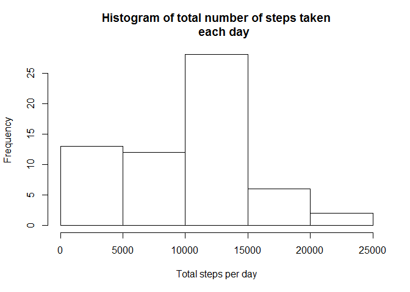
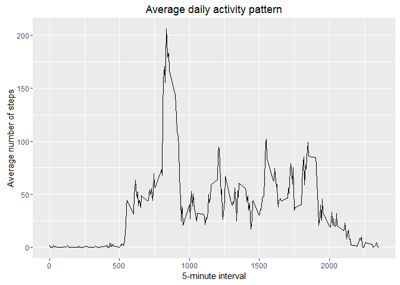
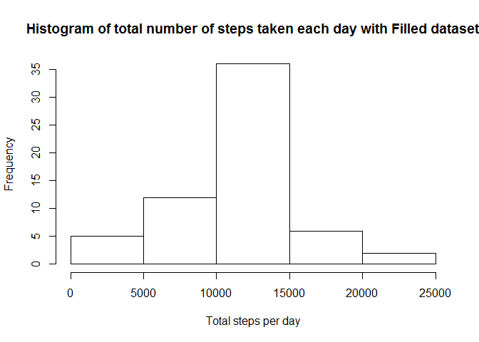
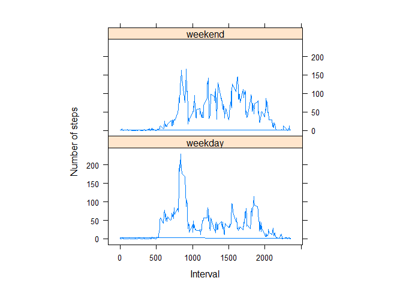

# Reproducible Research: Peer Assessment 1


## Loading and preprocessing the data

1. Read in the data

```r
require(data.table)
require(ggplot2)
require(lattice)
activity<-fread("activity.csv", na.strings = "NA")
```

2. Convert date column from char to Date type

```r
activity$date<-as.Date(activity$date)
```


## What is mean total number of steps taken per day?

1. The histogram of total number of steps taken per day
<!-- -->

 

2. The mean of the total number of steps taken per day is **9354**.


3. The median of the total number of steps taken per day is **10395**.


## What is the average daily activity pattern?

1. Time series plot (i.e. type = "l") of the 5-minute interval (x-axis) and the average number of steps taken, averaged across all days (y-axis)

```r
activity[, average_steps_by_interval:= mean(steps, na.rm = T), by=interval]
ggplot(activity, aes(interval, average_steps_by_interval))+
        geom_line()+
        ggtitle("Average daily activity pattern") + 
        ylab("Average number of steps") +
        xlab("5-minute interval")
```

<!-- -->


2. **835** interval has maximum number of steps.


## Imputing missing values


1. The total number of missing values in the dataset is **2304**.

2. To fill in missing values we use the mean for that 5-minute interval.

3. Create a new dataset that is equal to the original dataset but with the        missing data filled in

```r
filled<- copy(activity)
filled[is.na(steps), steps:= ceiling(average_steps_by_interval)]
```

4. Make a histogram of the total number of steps taken each day with **new dataset**.
<!-- -->

 

The **new** mean of the total number of steps taken per day is **10785**.


The **new** median of the total number of steps taken per day is **10909**.

As wee see new values differ from the estimates from the first part of the assignment. The mean value increased as minimum as 15% and the median also increased at 5%.


## Are there differences in activity patterns between weekdays and weekends?

1. Create a new factor variable in the dataset with two levels – “weekday” and    “weekend” indicating whether a given date is a weekday or weekend day.

```r
filled$daytype<-ifelse((weekdays(filled$date) %in% c("Sunday","Saturday")), "weekend","weekday")
filled$daytype<-as.factor(filled$daytype)
filled[, average_steps_by_interval:= mean(steps, na.rm = T), by=.(interval, daytype)]
```

2. Making a panel plot containing a time series plot (i.e. type = "l") of the 5-minute interval (x-axis) and the average number of steps taken, averaged across all weekday days or weekend days (y-axis).
<!-- -->
